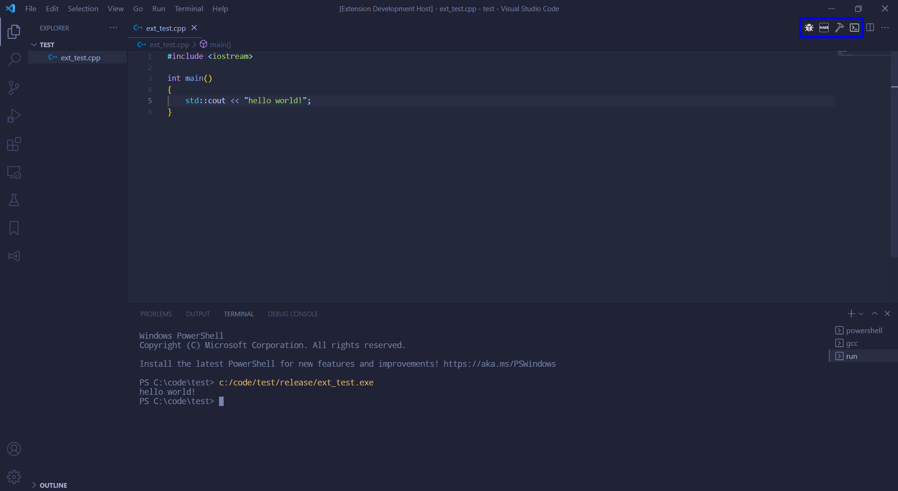

## Features

- Compile for Release Button
- Compile for Debug Button
- Run Button
- MakeFile Button

## How to use
* **Set the Compiler:** set the compiler you want to use in the settings (you should have it installed on your computer) if your compiler isn't there, select `other`.
* **Write the Command:** the command depends on the compiler you selected, if you selected `other` then the `cppbuttons.release "other" command` will be used, same for `gcc` and `msvc`. The keyword `{file}` will be replaced with the file that you are editing and `{exe}` with the program name (same as the file name).
* **MakeFile:** This extension also has a Make button, useful for multiple files project. It simply write "make" in the console. To use this you should have makefile installed and a make file in your workspace folder. It is convenient to have a make file generator extension like ["C/C++ Makefile Project"](https://marketplace.visualstudio.com/items?itemName=adriano-markovic.c-cpp-makefile-project)
* **Debug:** It is good to have different folders to the release and debug build so one executable don't overlap the other. So in order to debug, we should edit the `launch.json` file.
  * since we have our own debug build, we don't need the `"preLaunchTask": "C/C++: g++.exe build active file"`. Delete this line
  * add your debug folder in `"program": "${fileDirname}\\${fileBasenameNoExtension}.exe"`. it should be anything like this:
  `"program": "${fileDirname}\\your debug folder\\${fileBasenameNoExtension}.exe"`
  * click F5 to debug, more on debugging [here](https://code.visualstudio.com/docs/editor/debugging)
* **More than one file:** The build buttons will compile the file opened in the editor. If your project has more than one cpp files (headers don't matter) it won't compile them all or link it, just the one opened in the editor. And the run button will try to run a executable with the name of the file that is opened in the editor. So if you have a multi-file project use the `Make` button and run using the command line.
* **Done:** To run the program click the `Run` button, to release build click the `Release Build` button, to build for debug click the `Debug Build` button and to call your MakeFile click the `Make` button. Fell free to look the settings and change it to your like. Happy coding!

## Extension Settings
This extension contributes the following settings:

* `cppbuttons.compiler`: choose the compiler to use
* `cppbuttons.ask parameters when run`: If true, the extension will ask for parameters to call the program before you run it.
* `commands`
  * `cppbuttons.release gcc command`: If you have "gcc" selected as your `cppbuttons.compiler` this command will be used to release-compile
  * `cppbuttons.release MSVC command`: If you have "MSVC" selected as your `cppbuttons.compiler` this command will be used to release-compile
  * `cppbuttons.release "other" command`: If you have "other" selected as your `cppbuttons.compiler` this command will be used to release-compile
  * `cppbuttons.debug gcc command`: If you have "gcc" selected as your `cppbuttons.compiler` this command will be used to debug-compile
  * `cppbuttons.debug MSVC command`: If you have "MSVC" selected as your `cppbuttons.compiler` this command will be used to debug-compile
  * `cppbuttons.debug "other" command`: If you have "other" selected as your `cppbuttons.compiler` this command will be used to debug-compile
* `folders`
  * `cppbuttons.release output folder`: Where the release build should generate it files.
  * `cppbuttons.debug output folder`: Where the debug build should generate it files.

## Known Issues
* If the output folders aren't set to `default` and aren't there, they will be created every time the extension initialize
